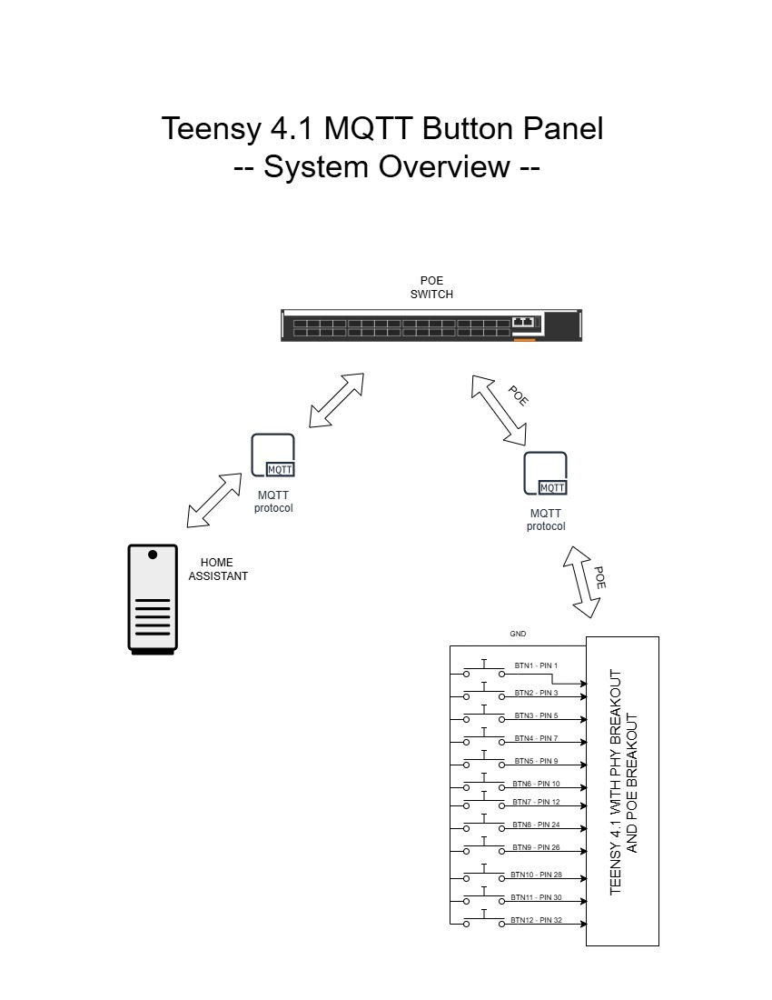
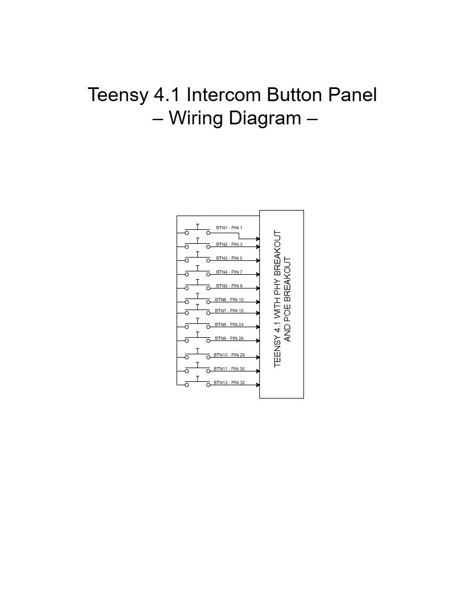
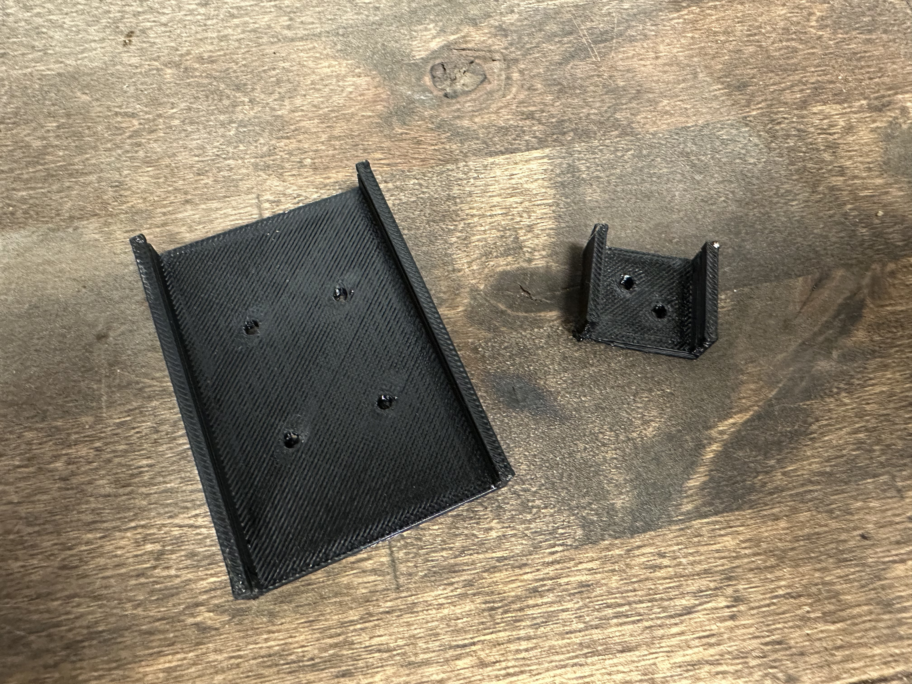
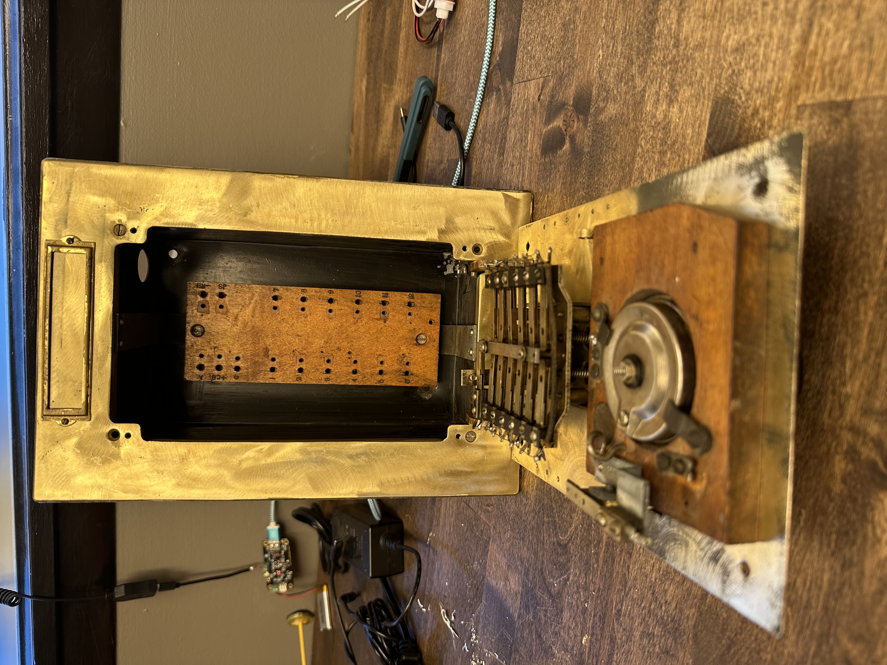
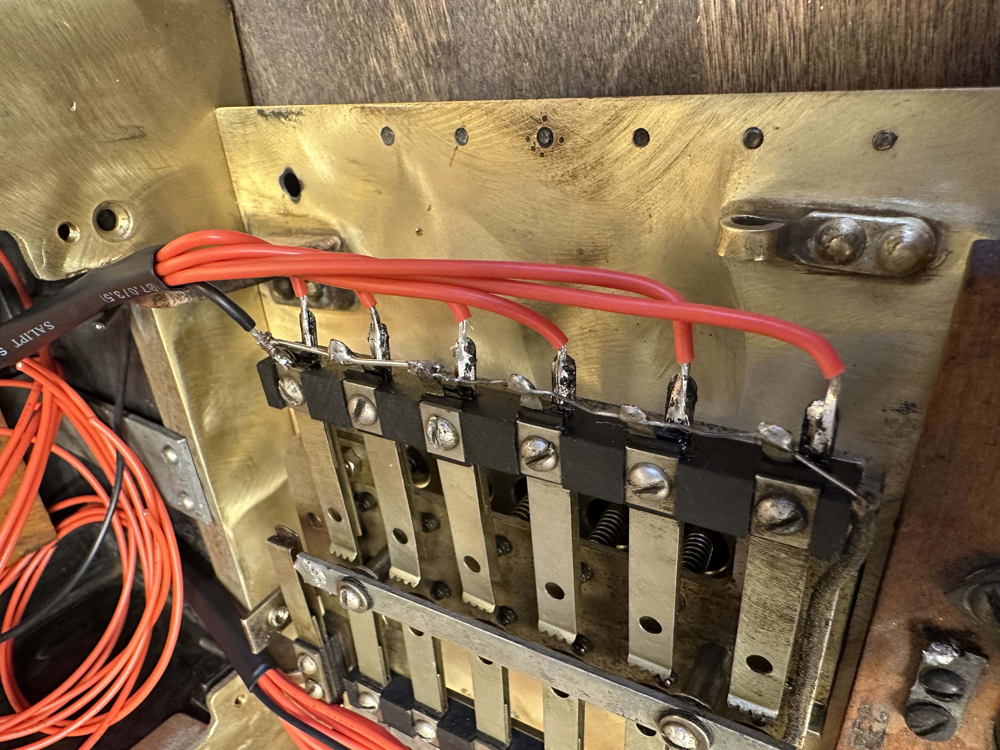
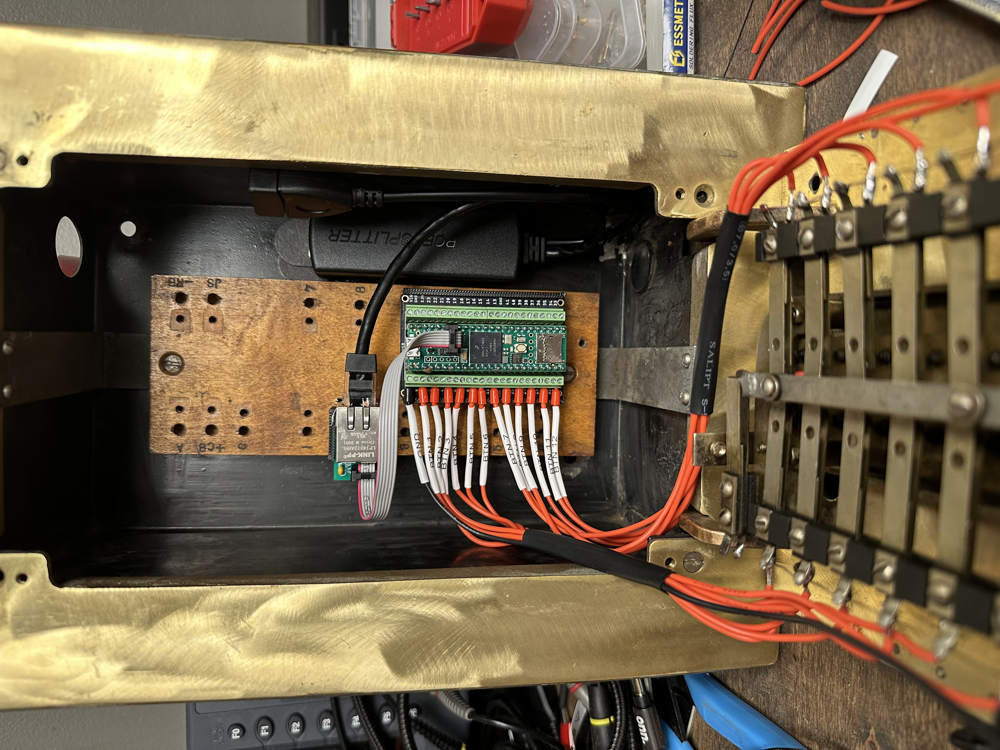
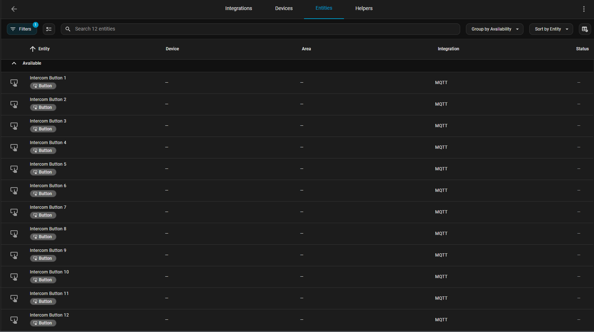
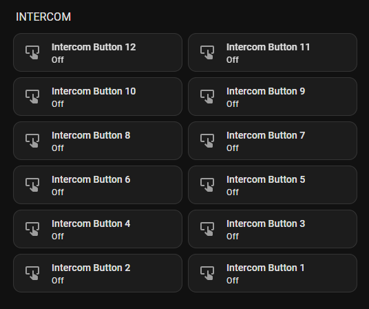

# Teensy 4.1 Intercom – MQTT Button Panel

## Demo Video

Turns a Teensy 4.1 + Ethernet kit into a **12-button MQTT panel** with Home Assistant discovery.  
Each button is exposed as a binary sensor in Home Assistant, with \ON\/\OFF\ state, plus an availability topic.

---

## ✨ Features
- 12 inputs (using \INPUT_PULLUP\, press = LOW)
- Native Ethernet with **QNEthernet**
- MQTT via **PubSubClient**
- Home Assistant auto-discovery
- Availability + periodic re-announce
- 3D printed bracket for mounting

---

## 🖼️ System Overview

This diagram shows how the Teensy fits into the network:  
buttons → Teensy 4.1 → Ethernet → MQTT broker → Home Assistant.

---

## 🔌 Wiring Diagram

Each button is wired from a Teensy pin to **GND**. Pins used are:

\\\
BTN1..BTN12 → 1, 3, 5, 7, 9, 10, 12, 24, 26, 28, 30, 32
\\\

All pins use \INPUT_PULLUP\, so pressing pulls the pin LOW.  
**Other side of every button = GND (shared).**

---

## 📸 Hardware Photos

| Printing Brackets | Empty Enclosure | Wiring | Final Mount |
|-------------------|-----------------|--------|-------------|
|  |  |  |  |

> More photos in [hardware/photos](hardware/photos).  
> If your exact filenames differ, update the links above (they were sanitized to remove spaces/parentheses).

---

## 🎥 3D Print Timelapse
[▶ 3D print timelapse video](hardware/photos/3D_print_timelapse.mp4)

---

## 🛠️ 3D Printed Parts
- [\Teensy_4.1_Ethernet_Mount.stl\](hardware/Teensy_4.1_Ethernet_Mount.stl)  
  Bracket to hold the Teensy with the PJRC Ethernet kit.

---

## 📡 MQTT
See [docs/mqtt-topics.md](docs/mqtt-topics.md).

---

## 🏠 Home Assistant Integration

Entities appear automatically under **MQTT → Binary Sensors** (discovery).  

  

---

## ⚙️ Build Instructions (Arduino IDE 2.3.6)

1. **Boards Manager**: install “Teensy by PJRC” → select **Teensy 4.1**  
2. **Library Manager**: install  
   - **QNEthernet** (Shawn Silverman)  
   - **PubSubClient** (Nick O’Leary)  
3. Copy \firmware/TeensyIntercom/secrets_example.h\ → \secrets.h\ and edit with your broker details.  
   (\secrets.h\ is ignored by Git — safe to commit the project without it.)  
4. Open \firmware/TeensyIntercom/TeensyIntercom.ino\  
5. **Verify** → **Upload**

After upload, check MQTT:
\\\
intercom/availability = online
intercom/button/N = ON/OFF
\\\

---

## 📜 License
MIT — see [LICENSE](LICENSE).

---

## 🙏 Credits
- **QNEthernet** by Shawn Silverman  
- **PubSubClient** by Nick O’Leary  
- Built with Arduino IDE 2.3.6

## Bill of Materials
See [hardware/BOM.md](hardware/BOM.md) for the full parts list.

