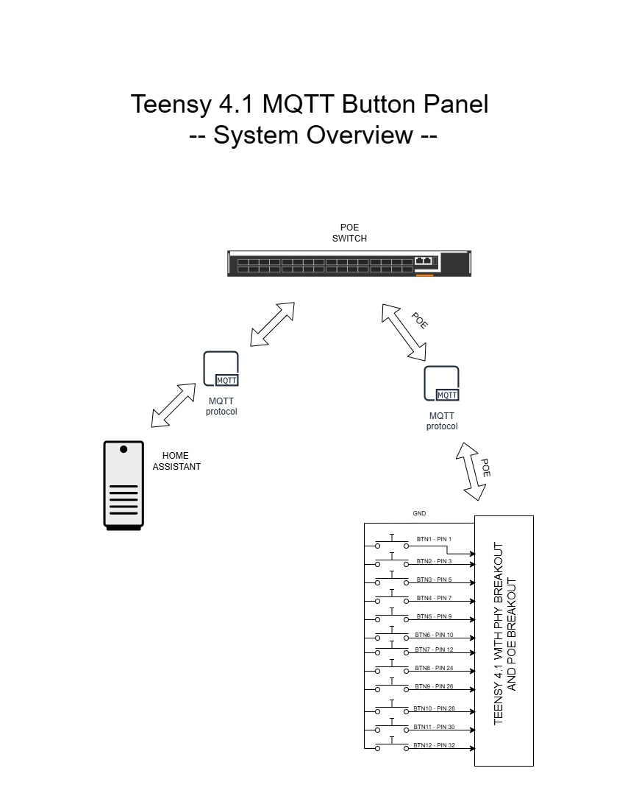
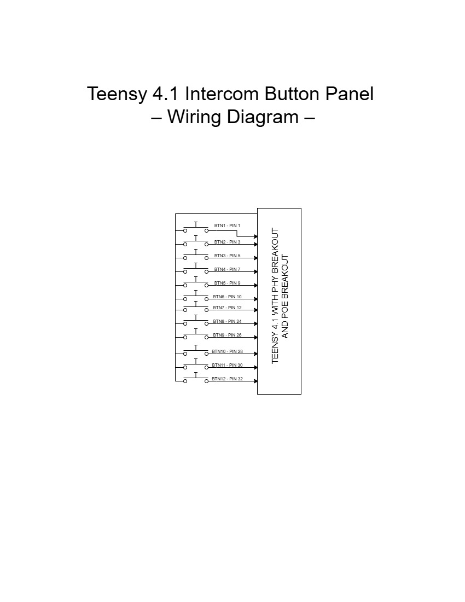
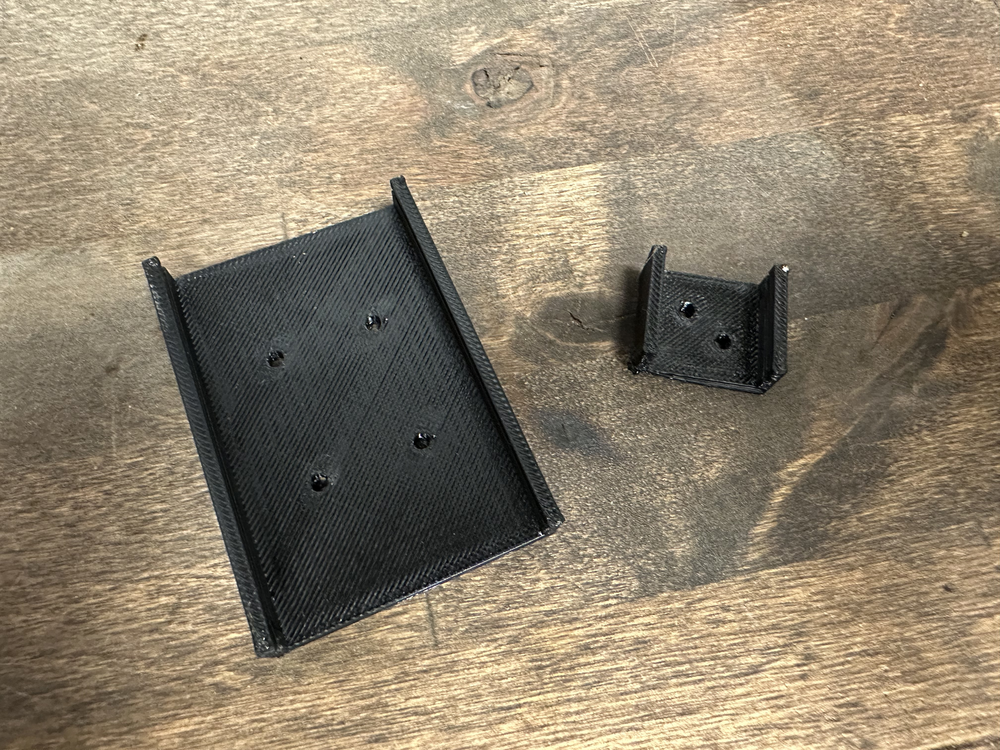
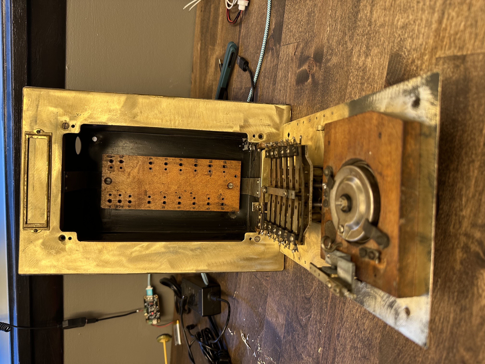
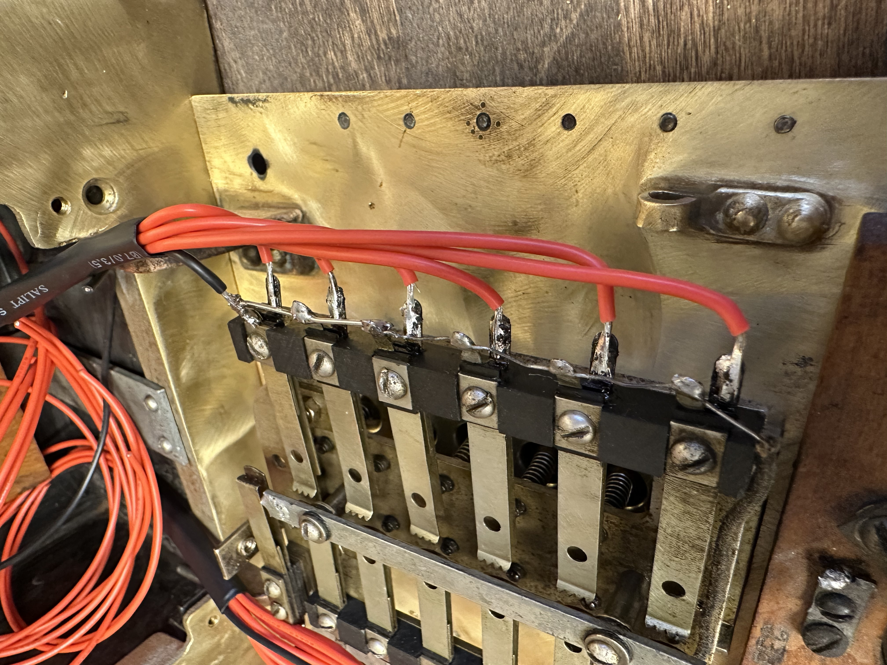
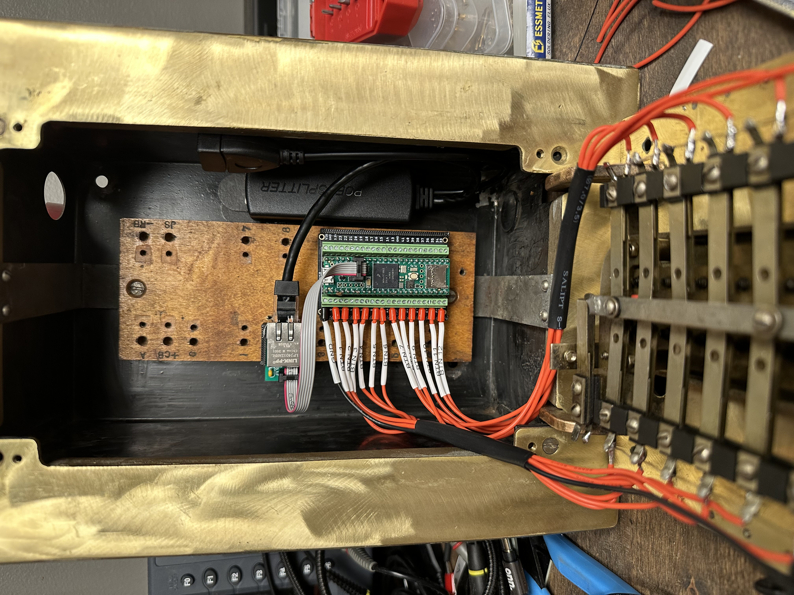
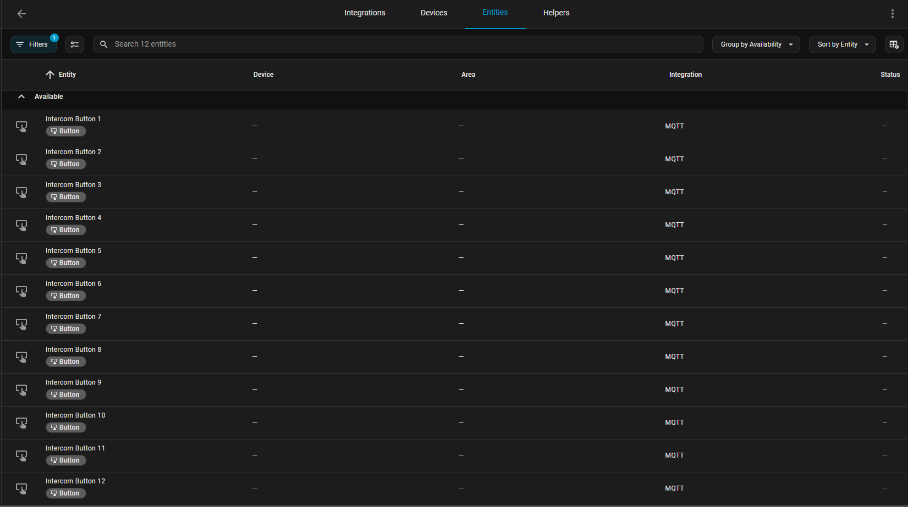
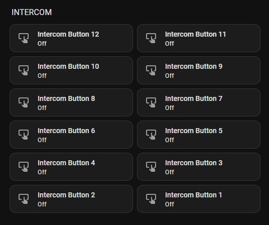

# Teensy 4.1 Intercom — MQTT Button Panel

Turns a Teensy 4.1 + Ethernet kit into a **12-button MQTT panel** with Home
Assistant auto-discovery. Each button shows up as a binary sensor, with an
availability topic so the panel goes unavailable when it is unplugged.

**No toolchain required.** Flash the prebuilt firmware, set your broker over
USB serial or the board's built-in web page, and the entities appear in Home
Assistant on their own.

## Demo Video
[](https://www.youtube.com/watch?v=SxNvHAskOwU)

---

## ✨ Features
- 12 inputs (`INPUT_PULLUP`, press = LOW)
- Native Ethernet with **QNEthernet**, MQTT via **PubSubClient**
- Home Assistant auto-discovery — nothing to add to `configuration.yaml`
- **Runtime configuration** in EEPROM: no editing source, no recompiling
- Setup over a **USB serial wizard** or a **built-in web page**
- DHCP or static IP, optional MQTT authentication
- Availability topic + last will, and periodic discovery re-announce
- Fully non-blocking main loop
- 3D printed bracket for mounting

---

## 🚀 Get it running

```
1. Download teensy-intercom.hex from the latest release
2. Flash it with Teensy Loader (no Arduino IDE needed)
3. Serial monitor at 115200 baud → type: wizard
4. Entities appear in Home Assistant
```

Full walkthrough, including building from source: **[docs/quickstart.md](docs/quickstart.md)**

| Doc | What's in it |
|-----|--------------|
| [Quick start](docs/quickstart.md) | Flashing, first-time setup, LED codes, upgrading from 1.x |
| [Configuration](docs/configuration.md) | Every setting, serial commands, web page, changing the pin map |
| [Home Assistant](docs/home-assistant.md) | Discovery, the automation blueprint, manual automations |
| [MQTT topics](docs/mqtt-topics.md) | Topic layout and discovery payloads |

---

## 🖼️ System Overview


Buttons → Teensy 4.1 → Ethernet → MQTT broker → Home Assistant.

---

## 🔌 Wiring Diagram


Each button is wired from a Teensy pin to **GND**. Pins used are:

```
BTN1..BTN12 → 1, 3, 5, 7, 9, 10, 12, 24, 26, 28, 30, 32
```

All pins use `INPUT_PULLUP`, so pressing pulls the pin LOW.
**Other side of every button = GND (shared).**

To use different pins or a different number of buttons, edit `kButtonPins` in
[`firmware/TeensyIntercom/src/BoardConfig.h`](firmware/TeensyIntercom/src/BoardConfig.h)
— everything else follows automatically.

---

## 📸 Hardware Photos

| Printing Brackets | Empty Enclosure | Wiring | Final Mount |
|-------------------|-----------------|--------|-------------|
|  |  |  |  |

> More photos in [hardware/photos](hardware/photos).

---

## 🎥 3D Print Timelapse
[▶ 3D print timelapse video](hardware/photos/3D_print_timelapse.mp4)

---

## 🛠️ 3D Printed Parts
- [`Teensy_4.1_Ethernet_Mount.stl`](hardware/Teensy_4.1_Ethernet_Mount.stl)
  Bracket to hold the Teensy with the PJRC Ethernet kit.

---

## 🏠 Home Assistant

Entities appear automatically under **Settings → Devices & Services → MQTT**.




An automation blueprint is included — see [docs/home-assistant.md](docs/home-assistant.md).

---

## 🧑‍💻 Development

```bash
pio run              # build the firmware
pio run -t upload    # flash a connected Teensy
pio device monitor   # open the configuration console
make -C test/host    # run the host tests (no hardware needed)
```

The hardware-independent logic — config parsing, EEPROM persistence, button
debouncing — is covered by tests that run on any machine. CI runs those plus a
full firmware build on every push, and attaches a prebuilt `.hex` to tagged
releases.

Layout:

```
firmware/TeensyIntercom/
  TeensyIntercom.ino     thin sketch, nothing to edit
  src/                   the actual firmware
    IntercomApp.*        wiring: network, MQTT, buttons, config front-ends
    IntercomConfig.*     EEPROM-backed settings + parsing
    HaPublisher.*        Home Assistant discovery and state publishing
    ButtonPanel.*        debounced scanning
    SerialConsole.*      USB serial console and setup wizard
    WebConfig.*          built-in configuration web page
    StatusLed.*          non-blocking status blinks
    BoardConfig.h        pin map and timings
test/host/               host tests + Arduino stubs
homeassistant/           automation blueprint
```

---

## 📦 Bill of Materials
See [hardware/BOM.md](hardware/BOM.md) for the full parts list.

---

## 📜 License and disclaimer

The code in this repository is **MIT** — see [LICENSE](LICENSE).

**No warranty.** This is a hobby project provided "as is", without warranty of
any kind, express or implied, and without liability for any claim or damages
(see the LICENSE text for the binding wording). Nothing here is safety-rated:
do not use it for fire alarms, medical alerts, security systems, door
interlocks, or anything else where a missed button press could hurt someone or
cause loss. It is a doorbell-grade convenience device on a home network.

**You are responsible for your own build.** Wiring, mains-adjacent enclosure
work, network exposure, and anything you automate off these buttons are yours
to verify.

### Third-party licenses

| Component | License |
|-----------|---------|
| This repository's own code | MIT |
| [QNEthernet](https://github.com/ssilverman/QNEthernet) | **AGPL-3.0-or-later** |
| [PubSubClient](https://github.com/knolleary/pubsubclient) | MIT |

QNEthernet is copyleft. A **compiled binary** that links it — including any
`.hex` attached to a release here — is a combined work governed by the AGPL,
even though this repository's own source is MIT. That obligation is met by
publishing the complete corresponding source in this repository, and the
device's web page links back to it as AGPL-3.0 section 13 requires for a
network-facing interface.

Practically, for building your own panel from this repo: nothing is asked of
you. If you **redistribute modified binaries**, you must publish your modified
source under the AGPL. If you need a non-copyleft binary, QNEthernet's author
[invites licensing enquiries](https://github.com/ssilverman/QNEthernet#license).

*This is a plain-language summary by the authors, not legal advice.*

---

## 🙏 Credits
- **QNEthernet** by Shawn Silverman
- **PubSubClient** by Nick O'Leary
